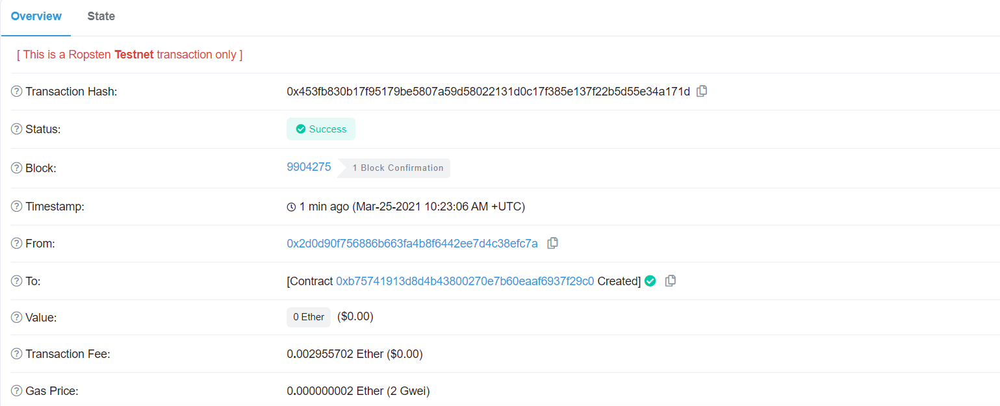
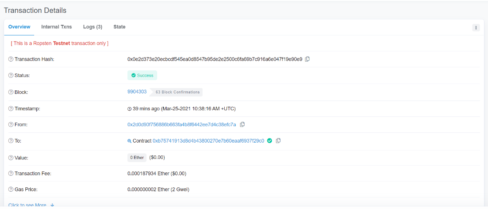
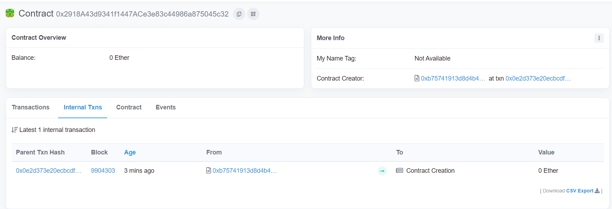
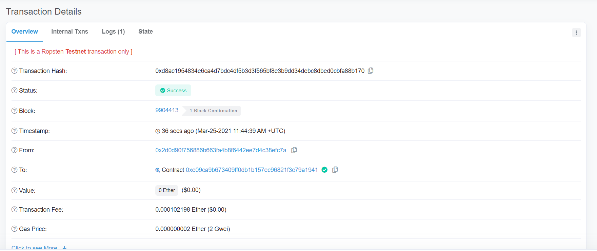
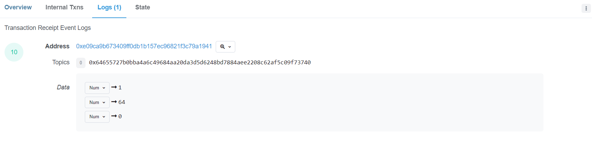
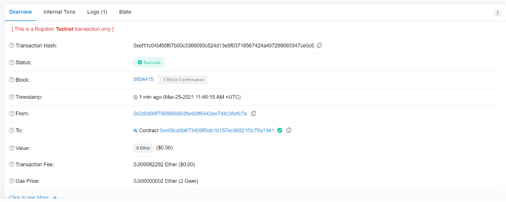
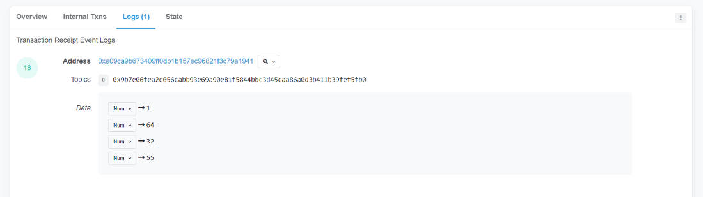

# MultiSigWalletContractDeployment
This project creates a MultiSig wallet contract with contract deployment feature through Bytecode.
A simple example is made available in the [Test](Test) folder.

## Use
1. Deploy the MultiSig wallet on the blockchain
2. Get the Bytecode of a contract you want to deploy through the concensus-based mechanism provided by the wallet
3. Call the `proposeSmartContract()` function which takes the Bytecode as argument
4. Approve on contract deployment using `signSmartContract()`
     - When the minimum required number of votes is reached, the contract will be deployed emiting the contract address

## Testing
In order to test the contract without having to use web3.
1. Create a contract similar to [TestingInteraction](Test/TestingInteraction.sol)
     - Modify the functions in order to reflect the name of the functions in the destination contract you're interacting with and its parameters
2. Call the destination contract functions through the intermediary TestingInteraction functions you've created

## In depth guide
This solution will use two main components: A Multisig wallet and a contract deployment function. We will define a few terms to simplify the explanation.
* Parent contract: the Multisig wallet contract
* Child contract: the contract that needs consensus before deployment
* Stakeholders: all accounts that are participating in the contract deployment

A Multisig wallet is a contract that allows multiple parties to share a single wallet, proposing transactions (to/from the account) and agreeing on these transactions through a pre-defined consensus mechanism (simple majority of stakeholders for example).
Our goal was to create a Multisig wallet that integrates a contract proposal and approval mechanism. The contract structure would look as in snippet 1.
``` solidity
contract MultiSigWallet {
    function proposeSmartContract(bytes memory _byteCode)validOwner public{}
    
    function signSmartContract(uint contractId)validOwner public payable{}
    
    function createSmartContract (bytes memory _byteCode) internal returns (address _contractAddress, bytes memory _returnedData) {}
}
```
With this skeleton in mind, we developed the Multisig wallet with contract deployment functionality.
We will briefly explain how the relevant functions work.
1.	`proposeSmartContract()`
This function takes as input the bytecode of the smart contract we want to deploy (obtained after compilation of the child contract) and adds it to a pending list of contracts.
2.	`signSmartContract()`
This function takes as input the contract ID and signs the smart contract. If this signature results in the consensus mechanism conditions being met, the createSmartContract() internal function is called.
3.	`createSmartContract()`
This function takes the contract bytecode as input and uses assembly to deploy the bytecode. It returns the address of the deployed contract and any data that was sent back (if applicable).

We tested our contract using MetaMask. To do so we first created two accounts since the minimal number of different signatures to deploy the contract is 2 (As per our simplified consensus mechanism). On the Ropsten testnet, we sent Ethers to both our accounts to perform the different transactions needed to deploy our Multisig contract. The first step was to compile the MultisigWallet.sol code and then deploy the contract on the blockchain (figure 1).We then saved both the transaction hash and contract address (from the ‘To’ field) for future use. 


Figure 1: MultiSigWallet contract transaction

The next step was to go to the deployed contract in Remix IDE. In the field AddOwner, we added a new owner using the address of our second account. Then we compile the SimpleStorage.sol file and in the compilation details, we saved the byte code. We then proposed a new contract using the `ProposeSmartContract()` function using the byte code saved. Finally, we signed the contract twice with both accounts, with contractId being ‘0’ as it’s the first contract deployed. Once the consensus mechanism is satisfied an internal transaction is initiated (figure 2) and the contract is deployed (figure 3).


Figure 2: Transaction that resulted in contract creation


Figure 3: Deployed SimpleStorage contract from MultiSigWallet

Finally, to interact with our Smart Contract , we used the [TestingInteraction](Test/TestingInteraction.sol) source code. After compiling it and deploying it (figure 4), we set the address of our deployed smart contract using `SetAddressOfDeployedContract()` and then `SetStorage()` to any number (here we picked ‘55’). As expected from the event statement in the `SetStorage()` function, the successful transaction returns a true Boolean value (figure 5). 


Figure 4: `setStorage()` function call from TestInteraction


Figure 5: Logs of the TestInteraction `setStorage()` function call

Finally, we called the function `getStorage()` (figure6) from the TestInteraction.sol code and in the logs, we get an emitted valued of ‘55’.


Figure 6: `getStorage()` function call from TestInteraction


Figure 7: Logs of the TestInteraction `getStorage()` function call

From here, we can conclude that our Multisig wallet is able to deploy a contract after consensus of all wallet owners, the contract is successfully stored on the blockchain and can be interacted with.

## Next steps
Given the simplicity of this solution, it should be preferred over the use of an off-chain solution as it introduces more complexity and hence increases the vulnerability of the design. Next steps will consist of:
* Creating a simple DApp to simplify interaction with the contract 
* Assessing the security of the design
* Comparing Multisig-based contract deployment and simple/native contract deployment
